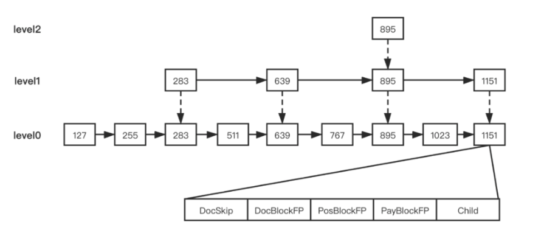
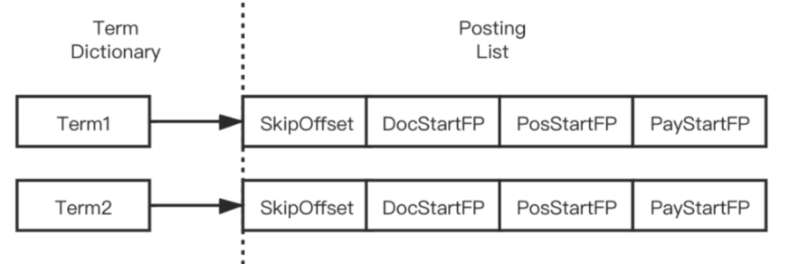

## Es倒排索引

* 倒排索引，将文档里的所有单词作为索引，单词对应每个文档的ID。
  * 用倒排索引是将每行数据的所有字段分词后，将每个词对应这个文档id，并统计所有数据行的索引，并合并成一个Map，key为词语，value为这个词语出现过的文档ID集合
    *  关键点： **分词**，**存储**（每个词语存储出现过该词的文档ID），**怎么找交集**。
* 正排索引，用某个字段来作为key ，key指向里整个数据行的位置
  * 正倒排序数据一样，索引建立时，正排的结构类似于B+树，用数据的某个唯一字段作为索引。

### 分词

具体见官网*https://www.elastic.co/guide/cn/elasticsearch/guide/current/analysis-intro.html*，有多种的分词手段，如根据空格，逗号。

#### 分词存储

* 对于字符串，采用前缀存储，相同前缀单词存储为一个前缀，其次前缀存储了所有单词情况
* 为了快速搜索前缀，使用了有限自动状态机FST，通过一步步输入找到前缀。

### 存储

#### 存储内容

* 单词的文档ID，频次，单词偏移位置，文档位置

#### 存储方式

* 针对ID和频次这种int类型数据，进行了相应的数据压缩
  * 一种将int[]数组中的最大值做占bit长度作为预设k，然后计算新的存储大小为，len(int[])*k/8字节，数组长度为128，且k为2则需要32字节大小，也就是4个long就能存储。
  * 另一种将int的存储按实际大小变化，例如2就一个字节，512就二个字节
* 将ID和频次拼接，其他字段也类似压缩也拼接一起。

### 交集查找

* 每个词的文档Id会从大到小排序，为了减少比对id时顺序查找的时间，使用了跳表
* 跳表在每个词对应的文档生成时便会形成。

### 数据结构

最终的数据结构可以理解为，一个单词对应了一个跳表

跳表的节点上记录了文档id，偏移信息，文档位置信息，和词频信息。

SkipOffset：用来描述当前 term 信息在 .doc 文件中跳表信息的起始位置。
DocStartFP：是当前 term 信息在 .doc 文件中的文档 ID 与词频信息的起始位置。
PosStartFP：是当前 term 信息在 .pos 文件中的起始位置。
PayStartFP：是当前 term 信息在 .pay 文件中的起始位置。

